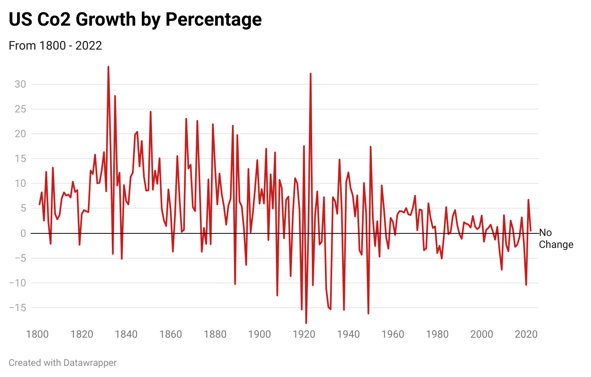

# USA-Co2 Percentage - Public Data Repository
This repository contains the percentage increase of carbon dioxide emissions in the United States from years 1800 to 2022.

## Origin
The base data comes from https://ourworldindata.org/energy Our World in Data. The base data contains data on all nations and all emissions regarding co2. 

Variables in the original data include:
* country
* year
* population
* iso_code
* gdp
* cement_co2
* cement_co2_per_capita
* co2
* co2_growth_abs
* co2_growth_prct
* share_global_other_co2
* share_of_temperature_change_from_ghg
* temperature_change_from_ch4
* temperature_change_from_co2
* temperature_change_from_ghg
* temperature_change_from_n2o
* total_ghg
* total_ghg_excluding_lucf
* trade_co2
* trade_co2_share

## Purpose
The trimmed data is intended to focus just on the increase in emission output by the United States. The only variable contained is "Percentage Increase" to give a clear frame of reference on the proportion of growth.

## Potential
Ideally this data can be used in climate research and examination. Common understanding is thar Co2 emissions have increased over time, however the data tells a slightly different story. Isolating and visualizaing data in this manner allows us to identify trends accuratley and make more educated hypotheses.

## Contents
Inside this repository there are two files and one folder with three files within it. Aside from this, the other folder titled "Google CoLab Documentation" contains the documentation of how the original data was manipulated. Within the folder "data" there are three folders. "USA_co2_prct.csv" contains the manipulated data from the original set. "owid-co2-data.csv" contains the original data set from Our World in Data. "data/txm5V-us-co2-growth-by-percentage.png" Contains the visualization of the manipulated data, also seen below.

This visualization was made with ! [datawrapper](https://app.datawrapper.de/)
